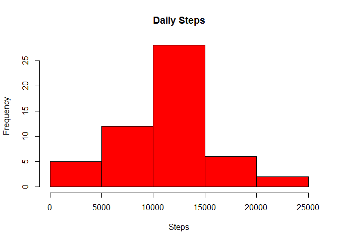

Loading and preprocessing the data
----------------------------------

### 1. Code for reading in the dataset and/or processing the data.

    library(mice)

    ## Loading required package: Rcpp

    ## mice 2.25 2015-11-09

    library(VIM)

    ## Loading required package: colorspace

    ## Loading required package: grid

    ## Loading required package: data.table

    ## VIM is ready to use. 
    ##  Since version 4.0.0 the GUI is in its own package VIMGUI.
    ## 
    ##           Please use the package to use the new (and old) GUI.

    ## Suggestions and bug-reports can be submitted at: https://github.com/alexkowa/VIM/issues

    ## 
    ## Attaching package: 'VIM'

    ## The following object is masked from 'package:datasets':
    ## 
    ##     sleep

    setwd("U:/R/COurse5/Week2")
    df.activity<-read.csv("activity.csv")

    summary(df.activity)

    ##      steps                date          interval     
    ##  Min.   :  0.00   2012-10-01:  288   Min.   :   0.0  
    ##  1st Qu.:  0.00   2012-10-02:  288   1st Qu.: 588.8  
    ##  Median :  0.00   2012-10-03:  288   Median :1177.5  
    ##  Mean   : 37.38   2012-10-04:  288   Mean   :1177.5  
    ##  3rd Qu.: 12.00   2012-10-05:  288   3rd Qu.:1766.2  
    ##  Max.   :806.00   2012-10-06:  288   Max.   :2355.0  
    ##  NA's   :2304     (Other)   :15840

What is mean total number of steps taken per day?
-------------------------------------------------

### 2. Histogram of the total number of steps taken each day

    daily.aggregate<-aggregate(x=df.activity$steps, by=list(date=df.activity$date), FUN=sum)

    hist(daily.aggregate$x, main="Daily Steps", xlab="Steps", col="red")

### 3. Mean and median number of steps taken each day

Average daily step count is 1.0766210^{4}.

Median daily step count is 10765.

What is the average daily activity pattern?
-------------------------------------------

    interval.aggregate<-aggregate(x=df.activity$steps, by=list(interval=df.activity$interval), FUN="mean", na.rm=TRUE)

    hist(interval.aggregate$x,  main="Average Interval Steps", xlab="Average number of steps per interval", col="blue")

### 4. Time series plot of the average number of steps taken

    plot(x=interval.aggregate$interval, y=interval.aggregate$x, type="l", xlab="Interval", ylab="Average Number of Steps", main="Average Number of Steps by Interval", ylim=c(0,250))
    with(subset(interval.aggregate, x==max(interval.aggregate$x)),text(interval,x,"*", col="red"))

### 5. The 5-minute interval that, on average, contains the maximum number of steps

    maximum<-subset(interval.aggregate, x==max(interval.aggregate$x))

It occures at 5-minute interval number 835. The average number of steps
at that interval is 206.2.

Imputing missing values
-----------------------

### 6. Code to describe and show a strategy for imputing missing data

    mice_plot <- aggr(df.activity, col=c('navyblue','yellow'),
                      numbers=TRUE, sortVars=TRUE,
                      labels=names(df.activity), cex.axis=.7,
                      gap=3, ylab=c("Missing data","Pattern"))

    ## 
    ##  Variables sorted by number of missings: 
    ##  Variable     Count
    ##     steps 0.1311475
    ##      date 0.0000000
    ##  interval 0.0000000

There are 2304 missing values in the dataset for variable "steps".

Missing values are imputed by using "mice" library's pmm method
(predictive mean method).

    imputed_Data <- mice(data = df.activity, m = 1, method = "pmm", maxit = 10, seed = 100)

    ## 
    ##  iter imp variable
    ##   1   1  steps
    ##   2   1  steps
    ##   3   1  steps
    ##   4   1  steps
    ##   5   1  steps
    ##   6   1  steps
    ##   7   1  steps
    ##   8   1  steps
    ##   9   1  steps
    ##   10   1  steps

    imputed_df.activity<-complete(imputed_Data, 1)

Missing data pattern plot below confirms the imputation.

    mice_plot <- aggr(imputed_df.activity, col=c('navyblue','yellow'),
                      numbers=TRUE, sortVars=TRUE,
                      labels=names(imputed_df.activity), cex.axis=.7,
                      gap=3, ylab=c("Missing data","Pattern"))

    ## 
    ##  Variables sorted by number of missings: 
    ##  Variable Count
    ##     steps     0
    ##      date     0
    ##  interval     0

### 7. Histogram of the total number of steps taken each day after missing values are imputed

    imp_daily.aggregate<-aggregate(x=imputed_df.activity$steps, by=list(date=imputed_df.activity$date), FUN=sum)

    hist(imp_daily.aggregate$x, main="Daily Steps", xlab="Steps", col="red")

Average daily step count after imputation is 1.109510^{4}.

Median daily step count after imputation is 11162.

The average values did not change much. This is because we used "pmm"
method (predictive mean method). Median is affected by imputation. The
new median is higher.

Are there differences in activity patterns between weekdays and weekends?
-------------------------------------------------------------------------

### 8. Panel plot comparing the average number of steps taken per 5-minute interval across weekdays and weekends

    #creating weekend indicator variable

    imputed_df.activity$weekend<-ifelse(weekdays(as.Date(imputed_df.activity$date)) %in% c("Saturday", "Sunday"), "YES", "NO")

    #calculating average step values by intervals

    imputed_daily.aggregate<-aggregate(x=imputed_df.activity$steps, 
                                       by=list(interval=imputed_df.activity$interval, weekend=imputed_df.activity$weekend), FUN=mean)

    par(mfrow=c(2,1))

    plot(subset(imputed_daily.aggregate, weekend=="YES")$interval, subset(imputed_daily.aggregate, weekend=="YES")$x,
         type="l",
         main="Weekend", 
         xlab="Interval",
         ylab="Average Number of Steps",
         ylim=c(0,220),
         col="blue")
    plot(subset(imputed_daily.aggregate, weekend=="NO")$interval, subset(imputed_daily.aggregate, weekend=="NO")$x,
         main="Weekdays", 
         type="l",
         xlab="Interval", 
         ylab="Average Number of Steps",
         ylim=c(0,220),
         col="red")

Average number of steps on weekeds are lower between 500 and 1000
intervals but slightly higher on the later intervals.
